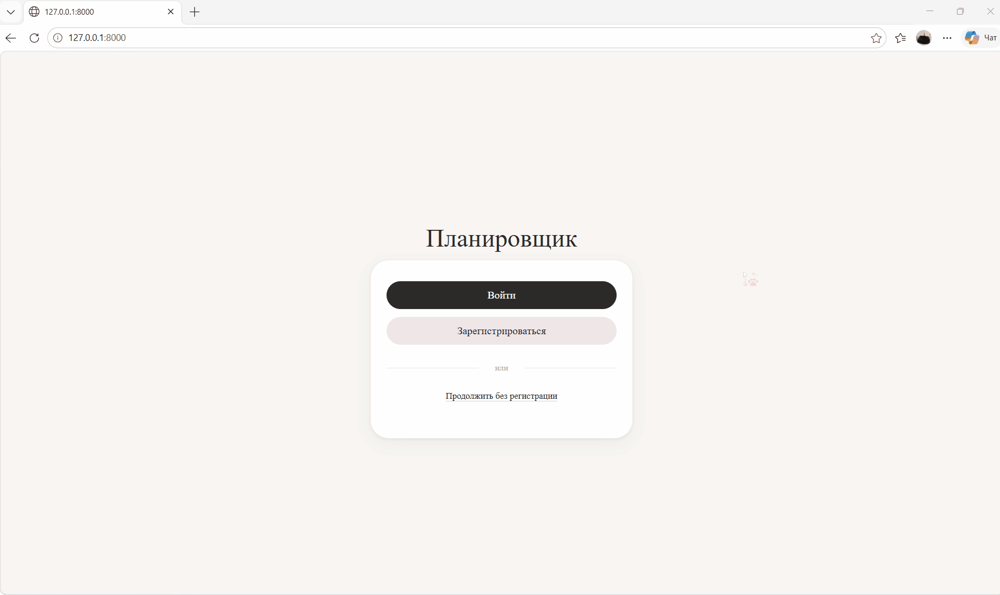

# Веб-приложение для планирования и контроля образовательной деятельности

Веб-приложение для управления задачами с учётом времени, категоризацией по типам учебной деятельности и визуализацией прогресса. Разработано в рамках курсовой работы.

## Функционал
- Регистрация и авторизация пользователей
- Создание, редактирование, удаление задач
- Категоризация по типам учебной деятельности
- Встроенный таймер 
- Статистика с графиками и фильтрацией по типам задач

## Демонстрация работы


## Технологии
- **Бэкенд:** Python 3.12, Django 6.0
- **База данных:** SQLite
- **Фронтенд:** HTML, CSS, JavaScript
- **Библиотеки:** Chart.js, Flatpickr, Font Awesome, Bootstrap

## Установка и запуск
1. Клонируйте репозиторий:
   ```
   $ git clone https://github.com/kokosikkkk/project.git
   cd project
    ```
2. Создайте и активируйте виртуальное окружение:
    ```
    $ python -m venv venv
    $ source venv/bin/activate 
    ```
3. Установите зависимости:
    ```
    $ pip install -r requirements.txt
    ```
4. Примените миграции:
    ```
    $ python manage.py migrate
    ```
5. Запустите сервер:
    ```
    $ python manage.py runserver
    ```
6. Откройте в браузере: http://127.0.0.1:8000

## Тестирование
Проект включает автоматизированные тесты.

Для запуска:
```
python manage.py test
```